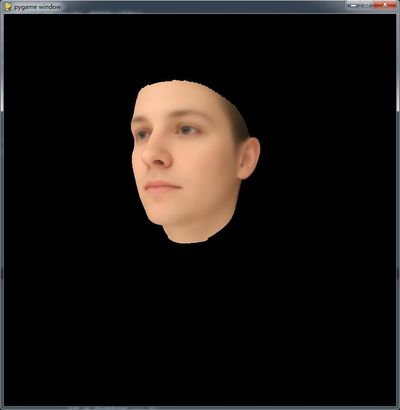
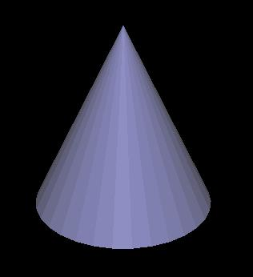
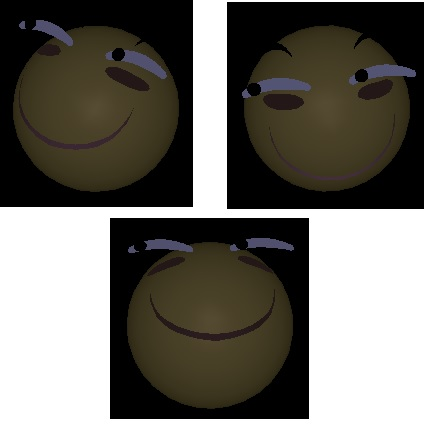

# Introduction
This a sample example for shwoing 3D obj with pygame, pyopengl.
**If you are familar with c++, trimesh2 is a better way to show 3D obj**. But this python code is simple and convient.
GitHub： https://github.com/changhongjian/pygame-show-obj
3D 人脸重建： https://github.com/YadiraF/PRNet
[CSDN博客介绍](https://blog.csdn.net/hongmaodaxia/article/details/78956487)

# Requirements
```bash
pip install pygame
pip install  PyOpenGL PyOpenGL_accelerate
```

# Demo
1.test_obj.py



You can use mouse to move, rotate and scale it. And you may set lighting for a better viewing. You need to be familiar with opengl.

(鼠标移动，自行设置光照，具体可以看代码)

See the code to learn more. (eg. I use `pickle` to accelerate loading)

2.test_mtl.py





# References

[OBJFileLoader](https://www.pygame.org/wiki/OBJFileLoader)
[BXT-AR-For-Python](https://gitee.com/791529351/BXT-AR4Python)


